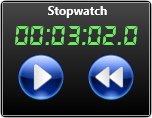

# Stopwatch
**Stopwatch Meter Gadget inspired by the well-known AddGadgets.com Windows Sidebar gadgets.**

The Stopwatch Gadget is a simple stopwatch with styling to match the [Gadgets](https://github.com/SilverAzide/Gadgets) suite.

**[Download the latest version here (4.0.0)](https://github.com/SilverAzide/Stopwatch/releases/download/v4.0.0/Stopwatch.-.Gadgets.Patch_4.0.0.rmskin)**

**NOTE:** 
The installer is in the form of a patch, which will patch your existing [Gadgets](https://github.com/SilverAzide/Gadgets) installation without affecting your existing configuration or layouts. If you don't have the Gadgets suite installed, this will install as a standalone skin.

## Features
* Allows pausing and resuming.
* Supports elapsed times greater than 24 hours.
* Scales to any desired size.

## Requirements
Rainmeter 4.4.0 or later: <https://www.rainmeter.net>. 

## Attribution
* [Gadgets](https://github.com/SilverAzide/Gadgets) by [SilverAzide](https://github.com/SilverAzide).
* [DS-Digital](https://www.dafont.com/ds-digital.font) font by Dusit Supasawat.

## License
Creative Commons Attribution-Noncommercial-Share Alike 3.0 License
